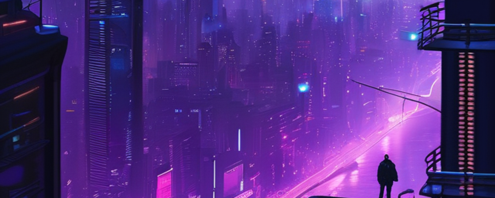

# Rudi - Front-End Developer

Welcome to my GitHub repository! I'm Rudi, a self-taught Front-End Developer based in beautiful Split, Croatia. With a deep passion for technology and a strong collaborative spirit, I'm on a mission to create stunning web experiences. If you're looking for a dedicated developer to join your team, you've come to the right place!

## 🛠 Skills

I specialize in Front-End Development, and my skill set includes:

- 💻 **Front-End Development:**
  - HTML5 / CSS
  - SCSS / Tailwind
  - JavaScript (TypeScript)
  - ReactJS
  - NextJS

- ⚛ **State Management:**
  - Redux
  - Redux Toolkit (RTK)
  - Jotai

- 👩🏻‍💻 **Component Libraries:**
  - Material UI
  - Kendo UI

- 👨🏻‍🎨 **UI/UX Design:**
  - Actively building UI designs
  - Proficient in Figma

## 🔗 Let's Connect

I'm actively looking for job opportunities and exciting projects to work on. If you're interested in collaborating or want to reach out, feel free to connect with me through [LinkedIn](https://www.linkedin.com/in/your-linkedin-profile) or drop me an email at [vladusic.rudi@gmail.com](mailto:vladusic.rudi@gmail.com).

Let's build amazing web experiences together! 🚀
